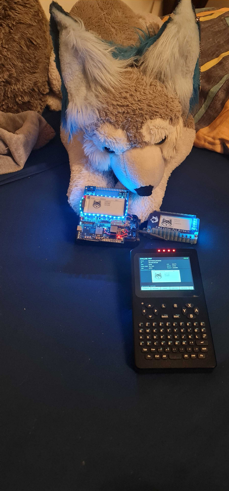

# CollarPet prototype photo integration handoff

## Goal
Integrate the latest prototype photos into the CollarPet Git repository as documentation assets. These are documentation images only; do not alter firmware, models, scripts, or runtime behavior while doing this pass.

## Source package
All renamed images are in `images/` beside this handoff file.

## Recommended tracked destination
Copy the images into:

`docs/images/prototype/`

Keep the filenames exactly as supplied unless the repository already has a stricter image naming convention.

## Files and intended use

| File | Content / suggested use |
|---|---|
| `collarpet-system-overview-fursuit-pt35-remote.png` | Best hero image. Shows the CollarPet prototype, PT35 terminal, remote, and intended wearable context together. Good for the top-level README. |
| `collarpet-sensor-board-top-overview.png` | Clean top-down technical overview of the current sensor/prototype board. Good for hardware documentation. |
| `collarpet-sensor-board-top-overview-alt.png` | Alternate top-down board shot with slightly different framing. Use only where the alternate angle is useful; avoid duplicating both in the same short section. |
| `collarpet-sensor-board-nvidia-bh1750-mic-closeup.png` | Close technical shot showing the NVIDIA package, BH1750 module, microphone breakout, LEDs, and e-paper edge. |
| `collarpet-bh1750-nvidia-mic-closeup.png` | Another useful close-up of the BH1750, NVIDIA package, and round microphone breakout. |
| `collarpet-nvidia-mic-module-closeup.png` | Focused NVIDIA + microphone module view. Useful for prototype/e-waste construction notes or the joke "onboard NVIDIA" section if one exists. |
| `collarpet-sensor-board-red-led-side-closeup.png` | Side/close view with red LEDs active; useful for LED/prototype construction documentation. |
| `collarpet-prototype-side-stack-and-wiring.png` | Side view showing stacked construction, exposed wiring, USB/HDMI ports, and mechanical arrangement. |
| `collarpet-orange-pi-cooling-uv5r-shell.png` | Shows SBC heatsink/fan arrangement inside the modified UV-5R donor shell. Use in mechanical/thermal notes. |
| `collarpet-prototype-parts-layout.png` | Exploded-ish layout showing sensor assembly, UV-5R shell/SBC section, Baofeng battery, and expansion board. Good for architecture/mechanical documentation. |
| `pt35-collarpet-main-ui.png` | PT35 running the CollarPet main UI/status screen. Use in PT35 software/UI docs. |
| `pt35-petmind-training-ui.png` | PT35 PetMind Training Recorder UI. Use in `docs/PETMIND_REAL_TRAINING.md` and/or PT35 training docs. |
| `collarpet-bench-overview-pt35-gpu-prototype.png` | Bench shot with PT35, large discrete GPU beside the prototype, and live CollarPet hardware. Fun development/prototype image; better suited to development/history docs than the main technical overview. |

## Recommended README integration

Top-level `README.md`:

1. Add `collarpet-system-overview-fursuit-pt35-remote.png` near the project introduction as the main prototype image.
2. Add `collarpet-sensor-board-top-overview.png` in the hardware/current-prototype section.
3. Do not turn the README into a gallery; 2-3 images on the main page is enough.

Suggested Markdown:

```md

```

and, where the current electronics are discussed:

```md

```

## Recommended detailed-doc integration

### PetMind training
In `docs/PETMIND_REAL_TRAINING.md`, place `pt35-petmind-training-ui.png` near the section describing the PT35 training/labeling workflow.

Suggested caption/alt text:

```md

```

Adjust the relative path if the document location requires `../docs/...` or another repository-relative form.

### PT35 docs
Use `pt35-collarpet-main-ui.png` in the PT35 README/status UI section and `pt35-petmind-training-ui.png` in the training subsection.

### Hardware / mechanical docs
Use these where appropriate:

- `collarpet-prototype-side-stack-and-wiring.png`
- `collarpet-orange-pi-cooling-uv5r-shell.png`
- `collarpet-prototype-parts-layout.png`
- one or two of the close-up sensor-board images

Prefer the most informative image for each section instead of inserting every near-duplicate.

## Important factual/context notes for captions

- These photos show the current rough prototype/development hardware, not a finished enclosure or production PCB.
- The NVIDIA package visible on the prototype is a physical salvaged package used as a playful/e-waste prototype detail; do not document it as a functioning GPU unless the repo already explicitly explains that context.
- The modified donor shell shown is from a Baofeng UV-5R style handheld housing/battery arrangement used mechanically for the prototype.
- The PT35 images show real running UI states and are useful evidence for the current software workflow.

## Do not do during this integration pass

- Do not crop, recolor, rotate, recompress, or otherwise edit the supplied images unless needed for an existing docs format requirement.
- Do not delete the originals from the temp/resource area solely because these copies were added to Git.
- Do not add all images to the top-level README.
- Do not claim hardware functions solely from appearance in a photo.

## Suggested final checks

After copying and editing docs:

1. Run `git status --short` and verify only intended images/docs were added or modified.
2. Check Markdown image paths from the actual document locations.
3. Preview the top-level README and PetMind training doc to make sure the large portrait images do not dominate the page.
4. Confirm no image exceeds any repository-specific asset-size policy.
5. Update any docs index only if a new gallery/hardware page is created; a simple image insertion does not require a new index entry.

## Optional follow-up

If desired, create `docs/PROTOTYPE_GALLERY.md` using the remaining images, grouped into:

- System overview
- PT35 UI
- Sensor/display board
- Mechanical stack and cooling
- Parts/layout

Keep the main README concise and link to the gallery rather than embedding every photo there.
