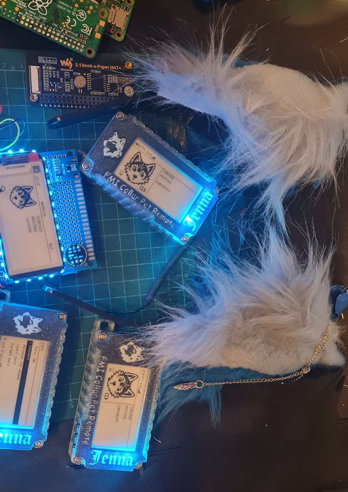
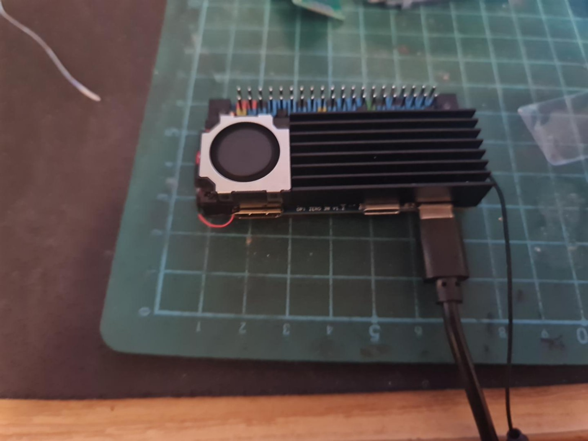
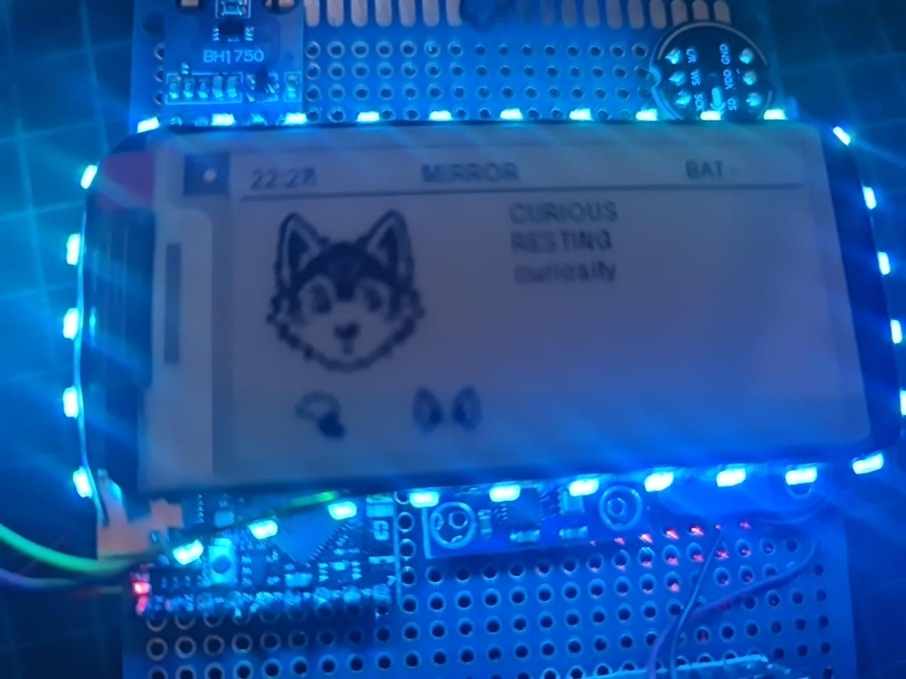

# CollarPet

**Human-directed • AI-assisted • open-source wearable computing experiment**

CollarPet is a personal wearable-computing project by **DakotaWolfi / Jenna Wolf**. It combines a small Linux SBC, an ESP32-S3 coprocessor, e-paper interfaces, sensors, lights, haptics, wireless remotes, and optional animatronic gear such as tails and ears.

The project is still a prototype. Expect active development, rough edges, changing hardware, and the occasional deeply questionable bench experiment.



## What it currently does

- Orange Pi-based main computer running the CollarPet runtime
- ESP32-S3 coprocessor for realtime hardware tasks
- E-paper UI for pet state, events, status, and song recognition
- Heltec Vision Master E213 remote controls over LoRa
- Tail Company tail integration over BLE
- EarGear integration over BLE
- Song recognition and known-song reactions
- RGB lighting and haptic feedback
- Environmental, motion, GPS, and other sensor integration
- Phone-friendly BLE ownership: CollarPet can connect when needed and release gear again when idle
- Experimental direct-servo active mode for more dynamic tail/ear behaviour

## Current prototype hardware

The current development system uses an **Orange Pi Zero 3W** as the main Linux computer and an **ESP32-S3** as the realtime coprocessor. The stack also includes an e-paper display, addressable LEDs, motion/environment sensors, and a small active heatsink/blower.



The final hardware is being redesigned into a cleaner stacked PCB assembly. Thermal management is still under active development because this is intended to be worn close to the body.

## Remote controls

CollarPet supports a small network of e-paper remotes. The current remote firmware provides pet state, actions, gear control, network status, and configuration while keeping the normal screen intentionally uncluttered.


The main CollarPet display follows the same visual language as the remotes: a large pet portrait, short state text, and contextual gear indicators instead of a dense engineering dashboard.



## Architecture

```text
                    +----------------------+
                    |   Orange Pi Zero 3W  |
                    |  Linux / pet runtime |
                    +----------+-----------+
                               |
                      UART / local links
                               |
                    +----------v-----------+
                    |      ESP32-S3        |
                    | realtime coprocessor |
                    +----------+-----------+
                               |
             +-----------------+------------------+
             |        |        |        |         |
           LEDs     haptic    IMU      GPS      sensors

        LoRa remotes <------ CollarPet ------> BLE gear
                                      |          tail / ears
                                      +-------> phone coexistence
```

The Orange Pi handles higher-level behaviour, UI, song recognition, networking, and BLE gear integration. The ESP32-S3 remains responsible for realtime hardware jobs such as LEDs, haptics, and sensor preprocessing.

## Hardware source status

The CollarPet hardware is intended to be open source as well.

The current PCB design files are not yet included in this repository because the present prototype revision contains third-party silkscreen artwork associated with Eurofurence 31. I do not want to redistribute that artwork without explicit permission from the relevant rights holders.

Once that is clarified, the hardware source files can be published here, or a clean version without the restricted artwork can be released.

Until then, the software is public, while the hardware design remains temporarily unpublished.


## Repository layout

```text
pi/                 Main Orange Pi runtime
remote/             Heltec Vision Master E213 remote firmware
tools/fan/          Experimental wearable-oriented fan controller
docs/               Project notes and images
```

## Development note

CollarPet is a project by **DakotaWolfi / Jenna Wolf**.

Development is **human-directed and heavily AI-assisted**, primarily using OpenAI ChatGPT as a coding, debugging, research, documentation, and design partner.

AI assistance has been an important part of making this project possible. It has opened up areas of software and engineering that would otherwise have been much harder to approach, while project direction, hardware design, assembly, testing, decisions, and validation remain hands-on work by the project maintainer.

The project does not attempt to hide or minimise that involvement. AI is used here as a development tool and collaborator, in the same spirit as using better instruments, documentation, libraries, and test equipment to make previously difficult ideas practical.

## Acknowledgements

Special thanks to **Dark Gure** and **Master Tailor** from the Tail Company Telegram community for the enthusiastic push to publish this project instead of keeping the monster on the workbench.

Thanks also to the projects, libraries, hardware vendors, and documentation authors that make experimental builds like this possible.

## Tail and EarGear integration

CollarPet can connect to compatible Tail Company / TailControl devices and EarGear over BLE. The integration includes normal canned actions as well as experimental direct-position control where supported.

This is an independent hobby project and is **not an official Tail Company product**.

## Status

Very much **work in progress**.

The current code in this repository represents the active prototype rather than a polished end-user release. Hardware and software interfaces may change without warning while the design settles.

## License

A project license has not been selected yet. Until one is added, normal copyright rules apply.
