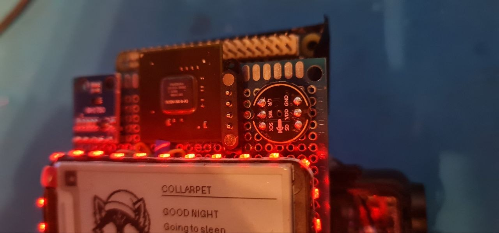

# CollarPet

**Human-directed • AI-assisted • open-source wearable computing experiment**

CollarPet is a personal wearable-computing project by **DakotaWolfi / Jenna Wolf**.

It combines a small Linux SBC, an ESP32-S3 coprocessor, e-paper interfaces, sensors, lights, haptics, wireless remotes, and optional animatronic gear such as tails and ears.

CollarPet started as an experimental wearable pet-computer and has gradually grown into a platform for sensors, e-paper controls, reactive lighting, haptics, song recognition, wireless remotes, and animatronic gear.

The project is still a prototype. Expect active development, rough edges, changing hardware, and the occasional deeply questionable bench experiment.


Software and schematics are public now. The production PCB layout is still in development.

## What it currently does

- Orange Pi-based main computer running the CollarPet runtime
- ESP32-S3 coprocessor for real-time hardware tasks
- E-paper UI for pet state, events, status, and song recognition
- Heltec Vision Master E213 remote controls over LoRa
- Tail Company tail integration over BLE
- EarGear integration over BLE
- Song recognition and known-song reactions
- RGB lighting and haptic feedback
- Environmental, motion, GPS, and other sensor integration
- Phone-friendly BLE ownership: CollarPet can connect when needed and release gear again when idle
- Experimental direct-servo active mode for more dynamic tail and ear behaviour

## Current prototype hardware

The current development system uses an **Orange Pi Zero 3W** as the main Linux computer and an **ESP32-S3** as the real-time coprocessor.

The stack also includes an e-paper display, addressable LEDs, motion and environmental sensors, and a small active heatsink/blower.


The final hardware is being redesigned into a cleaner stacked PCB assembly.

Thermal management is still under active development because this is intended to be worn close to the body, so simply staying below the silicon temperature limit is not good enough.

### Dedicated GPU*

Yes, CollarPet technically has a dedicated NVIDIA GPU.



\* Technically. There is a physically separate NVIDIA GPU package mounted on the board. It is not electrically integrated and currently contributes exactly zero GPU acceleration. The important part is that saying "it has a dedicated GPU" is now technically defensible.

## Remote controls

CollarPet supports a small network of e-paper remotes.

The current remote firmware provides pet state, actions, gear control, network status, and configuration while keeping the normal screen intentionally uncluttered.


The main CollarPet display follows the same visual language as the remotes: a large pet portrait, short state text, and contextual gear indicators instead of a dense engineering dashboard.

## Architecture

```text
                    +----------------------+
                    |   Orange Pi Zero 3W  |
                    |  Linux / pet runtime |
                    +----------+-----------+
                               |
                      UART / local links
                               |
                    +----------v-----------+
                    |      ESP32-S3        |
                    | real-time coprocessor|
                    +----------+-----------+
                               |
             +-----------------+------------------+
             |        |        |        |         |
           LEDs     haptic    IMU      GPS      sensors

        LoRa remotes <------ CollarPet ------> BLE gear
                                      |          tail / ears
                                      +-------> phone coexistence
````

The Orange Pi handles higher-level behaviour, UI, song recognition, networking, and BLE gear integration.

The ESP32-S3 remains responsible for real-time hardware jobs such as LEDs, haptics, and sensor preprocessing.

## Hardware source status

The CollarPet hardware is intended to be open source as well.

The repository already contains the current schematic and EasyEDA source files, so the electrical design is available for inspection and reuse.

The physical prototype is still built largely on perfboard and urgently needs to become a proper PCB revision.

The PCB layout itself is not published yet because the current design contains third-party Eurofurence 31 silkscreen artwork. I do not want to redistribute that artwork without explicit permission from the relevant rights holders.

Once that is clarified, the PCB layout can either be published with permission or released as a cleaned version without the restricted artwork.

## Repository layout

```text
pi/                 Main Orange Pi runtime (latest sync from temp resources/current)
remote/             Heltec Vision Master E213 remote firmware (latest sync)
esp32/              ESP32-S3 coprocessor firmware (latest sync)
pt35/               PM35/PT35 integration scripts, desktop launchers, dashboard link tools
PCB/                Schematics and EasyEDA source files
tools/fan/          Experimental wearable-oriented fan controller
docs/               Project notes and images
```

## Latest synced source bundles

The repository now includes the latest source snapshots from:

- `temp resurces/current/collar pet`
- `temp resurces/current/Wireles remote`
- `temp resurces/current/ESP32-s3 coprocessor`
- `temp resurces/current/pt35`

These are published in the tracked folders listed above so people can build from GitHub without browsing temporary archive folders.

## Build resources still needed

Some runtime resources are referenced by code but are not included in Git yet:

- Song database content and generated index files expected under `/home/jenna/collarpet/songdb`
- Vosk speech model expected under `/home/jenna/collarpet/models/vosk-model-small-en-us-0.15`
- Live state/config files created at runtime under `/home/jenna/collarpet/state` and `/home/jenna/collarpet/logs`
- System service and host config files such as `collarpet.service` and `/etc/collarpet/link.conf`

PetMind handoff artifacts are now tracked in:

- `pi/scripts/update-collarpet-shared-ble-scanfix.sh`
- `pt35/scripts/add-petmind-training-desktop-shortcut.sh`
- `pt35/scripts/update-pt35-petmind-training-ui-v2.sh`
- `artifacts/CollarPet_PetMind_RealTraining_Prep_v1.zip`

If you provide these resources (or preferred replacements), they can also be added/documented so third parties can fully reproduce your setup.

## Documentation

More detailed subsystem documentation is available in [`docs/`](docs/README.md), including:

- [System architecture](docs/ARCHITECTURE.md)
- [Song recognition](docs/SONG_RECOGNITION.md)
- [Remote network](docs/REMOTE_NETWORK.md)
- [BLE tail / EarGear integration](docs/BLE_GEAR.md)
- [ESP32-S3 coprocessor](docs/ESP32_COPROCESSOR.md)
- [Thermal management](docs/THERMAL_MANAGEMENT.md)
- [Hardware status](docs/HARDWARE_STATUS.md)
- [Luma voice commands](docs/VOICE_COMMANDS_PLAN.md)
- [PetMind real-world training](docs/PETMIND_REAL_TRAINING.md)

PT35 keyboard/download resources are documented in:

- `pt35/Downloads/README.md`
- `pt35/keyboard/README.md`
- `pt35/training/README.md`

## Development note

CollarPet is a project by **DakotaWolfi / Jenna Wolf**.

Development is **human-directed and heavily AI-assisted**, primarily using OpenAI ChatGPT as a coding, debugging, research, documentation, and design partner.

AI assistance has been an important part of making this project possible. It has opened up areas of software and engineering that would otherwise have been much harder to approach, while project direction, hardware design, assembly, testing, decisions, and validation remain hands-on work by the project maintainer.

The project does not attempt to hide or minimise that involvement. AI is used here as a development tool and collaborator, in the same spirit as using better instruments, documentation, libraries, and test equipment to make previously difficult ideas practical.

## Tail and EarGear integration

CollarPet can connect to compatible Tail Company / TailControl devices and EarGear over BLE.

The integration includes normal preset actions as well as experimental direct-position control where supported.

This is an independent hobby project and is **not an official Tail Company product**.

## Acknowledgements

Special thanks to **Dark Gure** and **Master Tailor** from the Tail Company Telegram community for the enthusiastic push to publish this project instead of keeping the monster on the workbench.

Thanks also to the projects, libraries, hardware vendors, and documentation authors that make experimental builds like this possible.

## Status

Very much **work in progress**.

The current code in this repository represents the active prototype rather than a polished end-user release.

Hardware and software interfaces may change without warning while the design settles.

## License

A project license has not been selected yet.

Until one is added, normal copyright rules apply.


