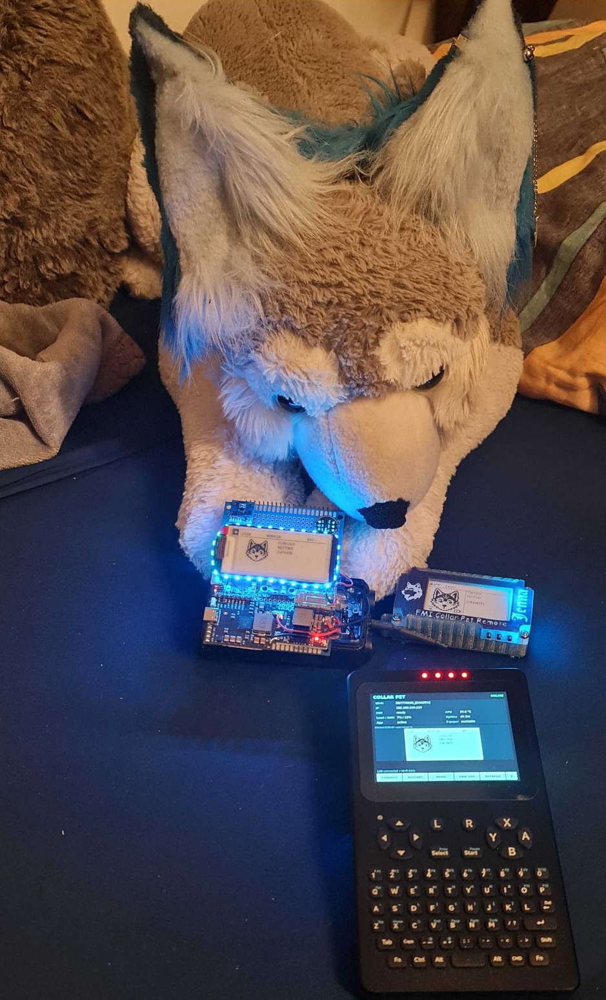
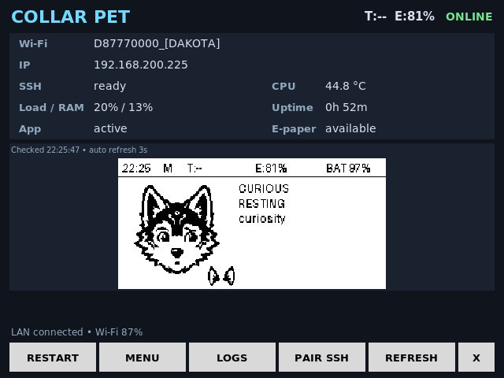
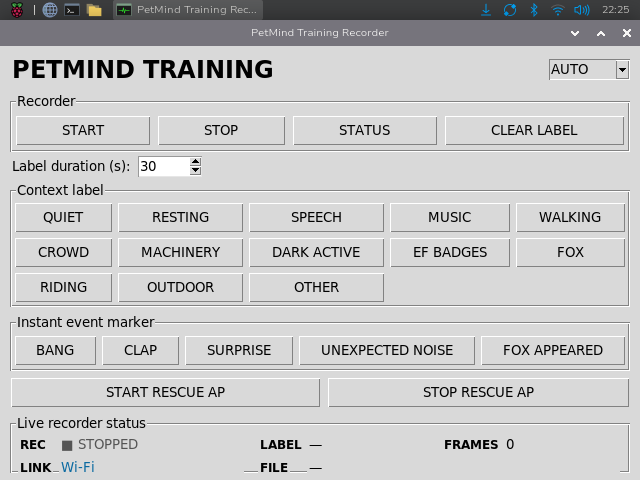
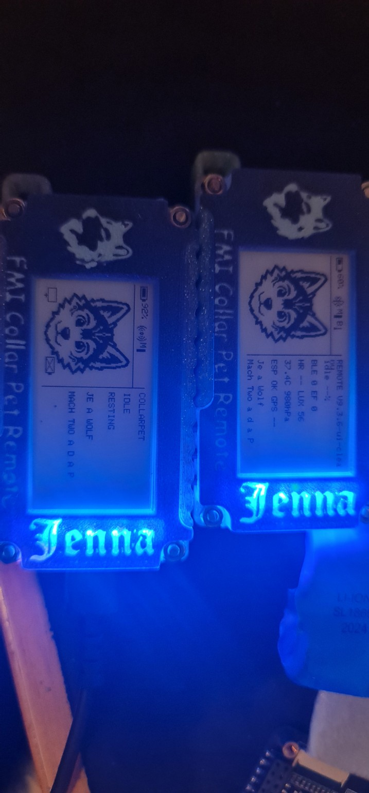
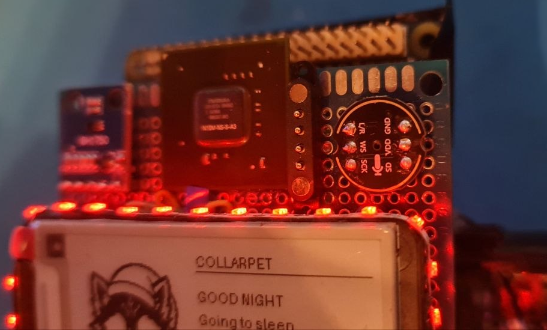
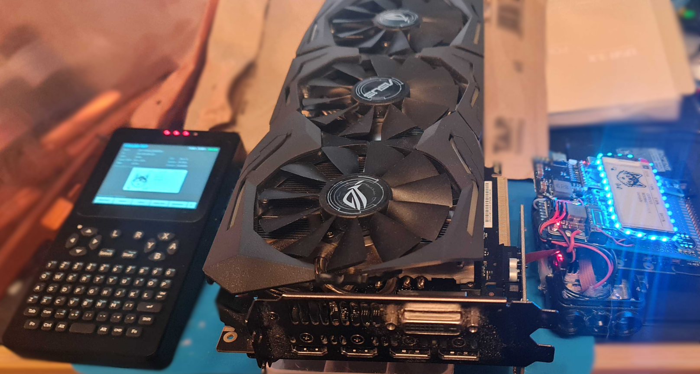

# CollarPet

**Human-directed • AI-assisted • open-source wearable computing experiment**

CollarPet is a personal wearable-computing project by **DakotaWolfi / Jenna Wolf**.

It combines a Linux SBC, an ESP32-S3 coprocessor, e-paper interfaces, sensors, RGB lighting, haptics, wireless remotes, BLE-connected animatronic gear, and an increasingly questionable amount of bench hardware.

It started as a wearable pet-computer experiment and has grown into a platform for reactive behaviour, sensor processing, song recognition, PetMind experiments, remote controls, animatronic gear integration, and whatever happened on the workbench that evening.

> **Prototype warning:** this repository follows the active development system. Expect rough edges, changing interfaces, experimental hardware, and the occasional deeply questionable engineering decision.



## What CollarPet currently does

- **Orange Pi Zero 3W** main computer for the higher-level CollarPet runtime
- **ESP32-S3** coprocessor for real-time hardware tasks
- E-paper UI for pet state, events, status, and song recognition
- PT35 pocket terminal dashboard, controls, diagnostics, and PetMind training
- Heltec Vision Master E213 LoRa remotes
- Tail Company tail integration over BLE
- EarGear integration over BLE
- Song recognition and known-song reactions
- RGB lighting and haptic feedback
- Environmental, motion, GPS, and other sensor integration
- Phone-friendly BLE ownership: CollarPet can connect when needed and release gear again when idle
- Experimental direct-servo active mode for more dynamic tail and ear behaviour
- PetMind real-world training / labelled event recording workflow

## Current prototype hardware

The current development system uses an **Orange Pi Zero 3W** as the main Linux computer and an **ESP32-S3** as the real-time coprocessor.

The prototype stack also includes an e-paper display, addressable LEDs, environmental and motion sensors, a small active heatsink/blower, and a large amount of hand-wired perfboard.


The final hardware is being redesigned into a cleaner stacked PCB assembly.

Thermal management is still an important part of the design because this is intended to be worn close to the body. Staying below the silicon temperature limit is not enough if the enclosure itself becomes uncomfortable.

## PT35 companion terminal

The PT35 acts as a portable dashboard and service terminal for CollarPet.

It can be used for status, controls, diagnostics, SSH access, maintenance tools, and PetMind training.



The PetMind training interface allows real-world events to be labelled and recorded from the PT35 without turning the main CollarPet display into a giant engineering dashboard.



## Architecture

```text
                    +----------------------+
                    |   Orange Pi Zero 3W  |
                    |  Linux / pet runtime |
                    +----------+-----------+
                               |
                      UART / local links
                               |
                    +----------v-----------+
                    |      ESP32-S3        |
                    | real-time coprocessor|
                    +----------+-----------+
                               |
             +-----------------+------------------+
             |        |        |        |         |
           LEDs     haptic    IMU      GPS      sensors

        LoRa remotes <------ CollarPet ------> BLE gear
                                      |          tail / ears
                                      +-------> phone coexistence

                 PT35 <------ network / tools ------> CollarPet
```

The Orange Pi handles higher-level behaviour, UI, song recognition, networking, BLE gear integration, and PetMind-related processing.

The ESP32-S3 handles real-time hardware jobs such as LEDs, haptics, and sensor preprocessing.

## Remote controls

CollarPet supports a small network of e-paper remotes.

The current remote firmware provides pet state, actions, gear control, network status, and configuration while keeping the normal screen intentionally uncluttered.



The main CollarPet display follows the same visual language as the remotes: a large pet portrait, short state text, and contextual indicators instead of a dense engineering dashboard.

## Yes, technically there is a dedicated NVIDIA GPU

This section exists because the prototype has reached the point where technical accuracy and stupidity overlap.



There is an actual **NVIDIA GPU package physically mounted on the prototype**.

It is salvaged, decorative, and **not electrically connected as a working graphics processor**.

So yes, CollarPet technically has a dedicated NVIDIA GPU.
Markings: N10M-NS-S-A3
Model: NVIDEA NVS 3100M
based on a GT218 Tesla 

**Thanks to the dedicated NVIDIA GPU, we expect significantly better FPS in games.**

...wait.

That's the decorative one.

The **GTX 1080 Ti** is the one that could, in principle, actually do graphics work:



To be clear: the 1080 Ti is **not part of the wearable build** and is not currently integrated into CollarPet.

The Orange Pi side already exposes a **PCIe x1 interface** through the small ribbon-cable connection visible in the prototype photos, so the basic PCIe path is actually present.

Making a GTX 1080 Ti work would still require the appropriate adapter/riser arrangement, external power, driver/software support, and a heroic disregard for the words *wearable*, *compact*, and *battery life*.

But unlike the decorative GPU package, it is at least a technically functional graphics card, and the host already has a real PCIe link available.

Current GPU status:

- **Dedicated NVIDIA GPU:** technically yes
- **Useful:** no
- **Improved gaming FPS:** Yes... but only if you realy believe in it. (not realy)
- **Could a GTX 1080 Ti theoretically be attached if the project completely lost control of itself:** technically yes
- **Finnisged PCB** no ther wil not be a dedicated GPU on the finished PCB. because  ... space sadly physics disagrees.

This is the kind of distinction that matters around here.

## Hardware source status

The CollarPet hardware is open source.

The repository contains the current schematics, PCB design files, and editable EasyEDA source files for the published hardware revisions. These files can be inspected, modified, and used to reproduce the electrical design.

The current physical prototype is still built partly on perfboard while the design transitions toward a cleaner stacked PCB assembly.

The hardware source files published in this repository do not contain the third-party Eurofurence 31 artwork used on some personal prototype designs. Any third-party artwork remains outside the scope of the CollarPet open-hardware license unless explicitly stated otherwise.

## Repository layout

```text
pi/                 Main Orange Pi runtime
remote/             Heltec Vision Master E213 remote firmware
esp32/              ESP32-S3 coprocessor firmware
pt35/               PT35 integration, keyboard firmware, dashboard and training tools
PCB/                Schematics and EasyEDA source files
tools/fan/          Experimental wearable-oriented fan controller
docs/               Project documentation and images
artifacts/          Preserved handoff / integration bundles
```

## PetMind and training

The repository includes the current PetMind V0.3 code/model resources and the PT35 real-world training workflow.

Tracked integration artifacts include:

- `pi/scripts/update-collarpet-shared-ble-scanfix.sh`
- `pt35/scripts/add-petmind-training-desktop-shortcut.sh`
- `pt35/scripts/update-pt35-petmind-training-ui-v2.sh`
- `artifacts/CollarPet_PetMind_RealTraining_Prep_v1.zip`

See [PetMind real-world training](docs/PETMIND_REAL_TRAINING.md) for the workflow, recovery notes, and current resource status.

## Runtime resources not included

Some generated or machine-specific resources are intentionally not tracked in Git:

- Song database content and generated index files expected under `/home/jenna/collarpet/songdb`
- Vosk speech model expected under `/home/jenna/collarpet/models/vosk-model-small-en-us-0.15`
- Live state/config files created at runtime under `/home/jenna/collarpet/state`
- Runtime logs under `/home/jenna/collarpet/logs`
- Host-specific service/config files such as `collarpet.service` and `/etc/collarpet/link.conf`

## Documentation

More detailed subsystem documentation is available in [`docs/`](docs/README.md), including:

- [System architecture](docs/ARCHITECTURE.md)
- [Song recognition](docs/SONG_RECOGNITION.md)
- [Remote network](docs/REMOTE_NETWORK.md)
- [BLE tail / EarGear integration](docs/BLE_GEAR.md)
- [ESP32-S3 coprocessor](docs/ESP32_COPROCESSOR.md)
- [Thermal management](docs/THERMAL_MANAGEMENT.md)
- [Hardware status](docs/HARDWARE_STATUS.md)
- [Luma voice commands](docs/VOICE_COMMANDS_PLAN.md)
- [PetMind real-world training](docs/PETMIND_REAL_TRAINING.md)

PT35 resources are documented in:

- `pt35/Downloads/README.md`
- `pt35/keyboard/README.md`
- `pt35/training/README.md`
- `pt35/scripts/README.md`

## Development note

CollarPet is a project by **DakotaWolfi / Jenna Wolf**.

Development is **human-directed and heavily AI-assisted**, primarily using OpenAI ChatGPT as a coding, debugging, research, documentation, and design partner.

AI assistance has been an important part of making this project possible. It has opened up areas of software and engineering that would otherwise have been much harder to approach, while project direction, hardware design, assembly, testing, decisions, and validation remain hands-on work by the project maintainer.

The project does not attempt to hide or minimise that involvement. AI is used here as a development tool and collaborator, in the same spirit as using better instruments, documentation, libraries, and test equipment to make previously difficult ideas practical.

## Tail and EarGear integration

CollarPet can connect to compatible Tail Company / TailControl devices and EarGear over BLE.

The integration includes normal preset actions as well as experimental direct-position control where supported.

This is an independent hobby project and is **not an official Tail Company product**.

## Acknowledgements

Special thanks to **Dark Gure** and **Master Tailor** from the Tail Company Telegram community for the enthusiastic push to publish this project instead of keeping the monster on the workbench.

Thanks also to the projects, libraries, hardware vendors, documentation authors, testers, and people willing to encourage questionable experiments that make builds like this possible.

## Status

Very much **work in progress**.

The current code in this repository represents the active prototype rather than a polished end-user release.

Hardware and software interfaces may change without warning while the design settles.

## License

CollarPet uses separate licenses for different parts of the project:

Software and firmware: MIT License
Original hardware designs, schematics and PCB design files: CERN Open Hardware Licence Version 2 – Strongly Reciprocal (CERN-OHL-S-2.0)
Documentation and original project media: CC BY-SA 4.0

Third-party components, libraries, artwork and hardware remain subject to their respective licenses and terms.
