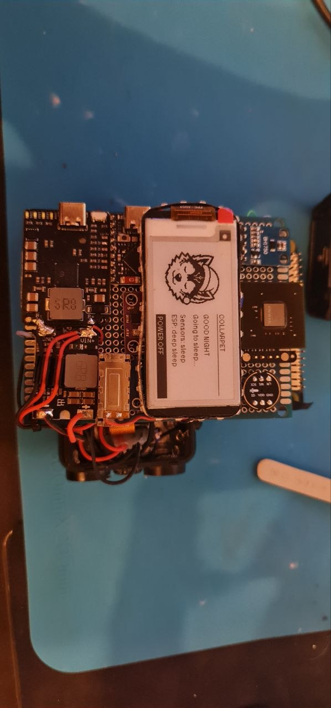
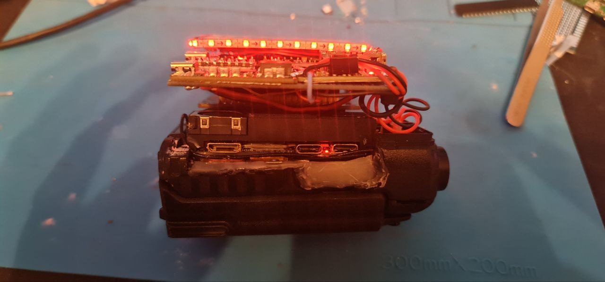
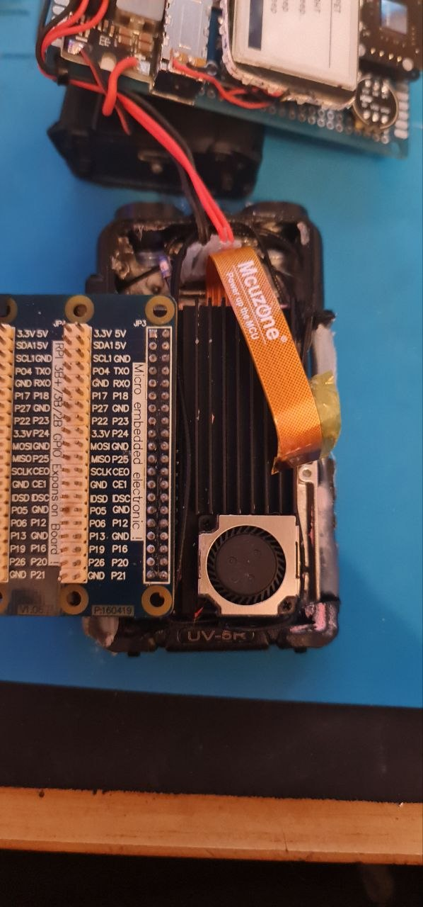
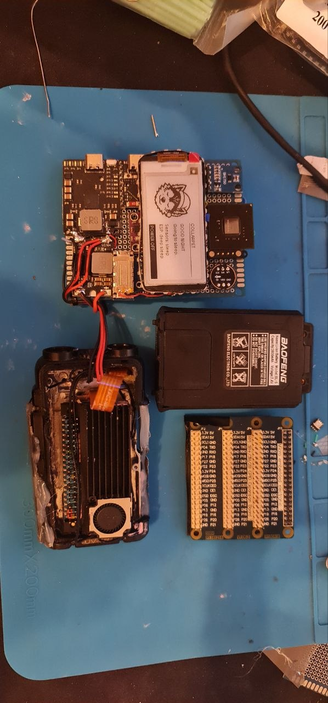
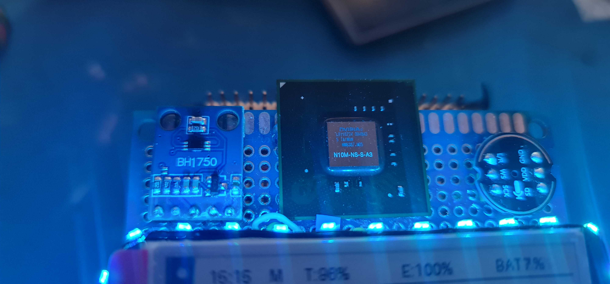

# Hardware status

CollarPet is currently between proof-of-concept hardware and a proper integrated PCB revision.

The current physical build still relies heavily on development boards, perfboard, wiring and stacked modules. It proves the architecture, but it urgently wants to become a proper PCB.

## Published files

The repository contains the current schematic PDF and EasyEDA source/design files that are suitable for public distribution.

## Open-hardware licensing direction

The intended hardware license is CERN Open Hardware Licence Version 2 — Strongly Reciprocal (`CERN-OHL-S-2.0`).

Third-party artwork is not part of the open-hardware source. Eurofurence 31 silkscreen artwork used on a private prototype revision is being removed from public hardware files rather than being relicensed without permission.

The goal is for the published PCB source to contain only material that can legitimately be distributed under the selected hardware license.

## Current prototype photos

These photos document the current development hardware and mechanical assembly. They show rough prototype construction, not a finished enclosure or production PCB.

Overall sensor/display board view:

Stacking/wiring side view:

SBC cooling arrangement in UV-5R style donor shell:

Prototype parts layout:

Technical close-up of sensor/LED/microphone area:

Note: the visible NVIDIA package on the prototype is a salvaged physical package detail used in prototype construction context; do not treat this image alone as evidence of an onboard functional GPU.
